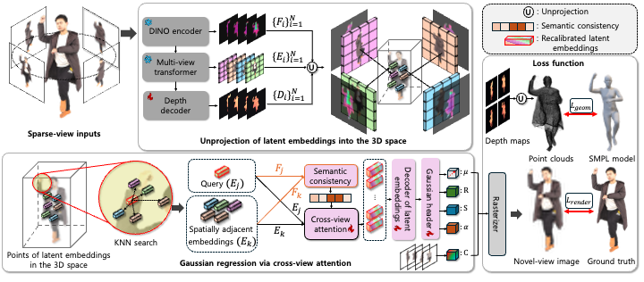

<h1 align="center">SemanticGHGS: Generalizable Human Gaussian Splatting<br>via Multi-View Semantic Consistency</h1>

<p align="center">
Official PyTorch implementation of <br>
<strong>"Generalizable Human Gaussian Splatting via Multi-View Semantic Consistency"</strong>
</p>

<p align="center">
<a href="https://github.com/jingi0614">Jingi Kim</a>,
<a href="https://sites.google.com/view/dcvl">Wonjun Kim</a> <strong>(Corresponding Author)</strong>
</p>

<p align="center">
<em>⛰️CVPR FINDINGS 2026⛰️</em>
</p>

<!-- <p align="center">
<a href="https://github.com/DCVL-3D/SemanticGHGS_release"></a>
</p> -->

<p align="center">
  
</p>
<p align="center">
  <em>Qualitative results of SemanticGHGS.</em>
</p>

<p align="center">
  
</p>
<p align="center">
  <em>Overall architecture of SemanticGHGS.</em>
</p>

---

## :eyes: Overview

**SemanticGHGS** is a feed-forward framework for **generalizable human Gaussian splatting** from sparse multi-view inputs.  
Our method is built on the key idea of **multi-view semantic consistency**, which encourages semantically corresponding regions across views to interact in a coherent 3D-aware manner.

Given sparse reference views, SemanticGHGS extracts multi-view visual features, lifts them into 3D-aware representations, and predicts Gaussian attributes for human rendering. By enforcing semantic consistency across views during feature aggregation, our framework improves cross-view correspondence, stabilizes Gaussian prediction, and produces more reliable renderings under sparse-view settings.

### Highlights

- 🚀 A feed-forward framework for sparse-view human Gaussian splatting
- 🌍 Multi-view semantic consistency for robust cross-view feature fusion
- 🧠 3D-aware feature aggregation for improved Gaussian prediction
- 🎯 Generalizable rendering without per-subject optimization
---

## 📦 Installation

### 1) Clone
```bash
git clone https://github.com/jingi0614/SemanticGHGS_release.git
cd SemanticGHGS_release
```

### 2) Create environment + install dependencies
We provide an installer:
```bash
bash install.sh
```

This will:
- create a conda env (`SemanticGHGS`, Python 3.8)
- install **PyTorch 2.0.1 + CUDA 11.8**, PyTorch3D, iopath
- install Python deps via `requirements.txt`
- build/install `./submodules/diff-gaussian-rasterization/`
---

## 🗂️ Dataset (THuman2.0)

## Dataset Preparation

Please request and download the official **THuman2.0** dataset.  
The request form is available here: [THuman2.0 Agreement Form](https://github.com/ytrock/THuman2.0-Dataset/blob/main/THUman2.0_Agreement.pdf)

Recommended directory structure:

```text
datasets/
└── THuman/
    ├── THuman2.0_Release/
    └── THuman2.0_smplx/
After downloading the raw scans, RGB images can be rendered by running:

```bash
python ./prepare_data/render_data.py
```
The corresponding SMPL-X parameters should be placed under the dataset directory.

## 🧪 Training

1) Set dataset paths in the config (example):
- `config/config_thu.yaml`

2) Run training:
```bash
python train.py --config config/config_thu.yaml
```

Checkpoints are saved under:
```text
experiments/<exp_name>/ckpt/
```

---

## 🎬 Evaluation / Inference

```bash
python test.py --config config/config_thu.yaml --ckpt <PATH_TO_CKPT>
```

Outputs (example):
```text
experiments/<exp_name>/test/
  *.jpg / *.png
  result.json
```

---

## License
This repository is released for research use.  
Third-party components under `submodules/` and `vggt/` may have their own licenses—please check them before use.

---

## Citation
If you use this codebase, please cite our paper:
```bibtex
@inproceedings{SemanticGHGS2026,
  title     = {Generalizable Human Gaussian Splatting via Multi-view Semantic Consistency},
  author    = {Jingi Kim and ...},
  booktitle = {CVPR (Findings)},
  year      = {2026}
}
```
